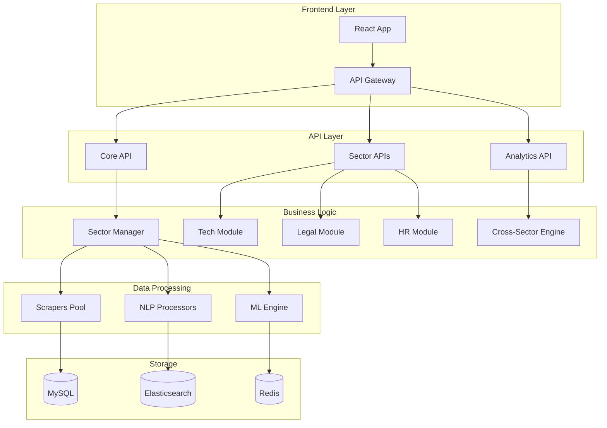

# 🛠️ Spécifications Techniques - Architecture Modulaire

## 📋 Table des matières

- [Architecture Système](#architecture-système)
- [Base de Données](#base-de-données)
- [Backend API](#backend-api)
- [Frontend Architecture](#frontend-architecture)
- [Système de Modules](#système-de-modules)
- [Services d'Intelligence](#services-dintelligence)
- [Sécurité et Performance](#sécurité-et-performance)
- [Déploiement et Infrastructure](#déploiement-et-infrastructure)

---

## 🏗️ Architecture Système

### **Stack Technique**

```yaml
Backend:
  - Framework: FastAPI (Python 3.11+)
  - ORM: SQLAlchemy 2.0
  - Cache: Redis 7+
  - Search: Elasticsearch 8+
  - Queue: RQ + Redis
  - NLP: spaCy + Transformers
  - Web Scraping: Scrapy + Playwright

Frontend:
  - Framework: React 18 + TypeScript
  - State Management: Zustand + React Query
  - UI Library: Tailwind CSS + Headless UI
  - Build Tool: Vite
  - Charts: Recharts + D3.js
  - Forms: React Hook Form + Zod

Infrastructure:
  - Containers: Docker + Docker Compose
  - Reverse Proxy: Nginx
  - Monitoring: Prometheus + Grafana
  - Logs: ELK Stack
  - CI/CD: GitHub Actions
  - Cloud: AWS/GCP (optionnel)
```

### **Microservices Architecture**



---

## 🗄️ Base de Données

### **Schéma Multi-Tenant par Secteur**

#### **Tables Principales**

```sql
-- Table des secteurs configurés
CREATE TABLE sectors (
    id VARCHAR(50) PRIMARY KEY,
    name VARCHAR(200) NOT NULL,
    description TEXT,
    config_path VARCHAR(500),
    is_active BOOLEAN DEFAULT TRUE,
    created_at TIMESTAMP DEFAULT CURRENT_TIMESTAMP,
    updated_at TIMESTAMP DEFAULT CURRENT_TIMESTAMP ON UPDATE CURRENT_TIMESTAMP
);

-- Table des offres d'emploi multi-secteurs
CREATE TABLE job_offers (
    id BIGINT AUTO_INCREMENT PRIMARY KEY,
    sector_id VARCHAR(50) NOT NULL,
    source_id VARCHAR(200) NOT NULL,
    title VARCHAR(500) NOT NULL,
    company VARCHAR(200),
    location VARCHAR(200),
    description LONGTEXT,
    requirements LONGTEXT,
    salary_min DECIMAL(10,2),
    salary_max DECIMAL(10,2),
    contract_type ENUM('CDI', 'CDD', 'Freelance', 'Stage', 'Alternance'),
    experience_level ENUM('Junior', 'Medior', 'Senior', 'Lead', 'Manager'),
    remote_work BOOLEAN,
    published_date DATE,
    scraped_at TIMESTAMP DEFAULT CURRENT_TIMESTAMP,
    processed_at TIMESTAMP NULL,
    
    FOREIGN KEY (sector_id) REFERENCES sectors(id),
    INDEX idx_sector_date (sector_id, published_date),
    INDEX idx_location (location),
    INDEX idx_company (company),
    FULLTEXT idx_description (description, requirements)
);

-- Table des mots-clés sectoriels
CREATE TABLE sector_keywords (
    id BIGINT AUTO_INCREMENT PRIMARY KEY,
    sector_id VARCHAR(50) NOT NULL,
    keyword VARCHAR(200) NOT NULL,
    category VARCHAR(100),
    subcategory VARCHAR(100),
    confidence DECIMAL(3,2) DEFAULT 0.0,
    frequency INT DEFAULT 0,
    trend_score DECIMAL(5,2) DEFAULT 0.0,
    last_seen DATE,
    
    FOREIGN KEY (sector_id) REFERENCES sectors(id),
    UNIQUE KEY unique_sector_keyword (sector_id, keyword),
    INDEX idx_category (sector_id, category),
    INDEX idx_frequency (sector_id, frequency DESC)
);

-- Table de liaison offres-mots-clés
CREATE TABLE job_offer_keywords (
    id BIGINT AUTO_INCREMENT PRIMARY KEY,
    job_offer_id BIGINT NOT NULL,
    keyword_id BIGINT NOT NULL,
    relevance_score DECIMAL(3,2),
    extraction_method VARCHAR(50),
    position_in_text INT,
    context_snippet TEXT,
    
    FOREIGN KEY (job_offer_id) REFERENCES job_offers(id) ON DELETE CASCADE,
    FOREIGN KEY (keyword_id) REFERENCES sector_keywords(id),
    UNIQUE KEY unique_job_keyword (job_offer_id, keyword_id)
);

-- Table des profils utilisateurs
CREATE TABLE user_profiles (
    id BIGINT AUTO_INCREMENT PRIMARY KEY,
    user_id VARCHAR(100) NOT NULL UNIQUE,
    primary_sector_id VARCHAR(50),
    secondary_sectors JSON,
    current_skills JSON,
    target_skills JSON,
    experience_level VARCHAR(50),
    career_goals JSON,
    preferences JSON,
    created_at TIMESTAMP DEFAULT CURRENT_TIMESTAMP,
    updated_at TIMESTAMP DEFAULT CURRENT_TIMESTAMP ON UPDATE CURRENT_TIMESTAMP,
    
    FOREIGN KEY (primary_sector_id) REFERENCES sectors(id)
);

-- Table des analytics sectoriels
CREATE TABLE sector_analytics (
    id BIGINT AUTO_INCREMENT PRIMARY KEY,
    sector_id VARCHAR(50) NOT NULL,
    metric_name VARCHAR(100) NOT NULL,
    metric_value DECIMAL(15,4),
    dimensions JSON,
    calculated_at DATE,
    
    FOREIGN KEY (sector_id) REFERENCES sectors(id),
    UNIQUE KEY unique_metric_date (sector_id, metric_name, calculated_at),
    INDEX idx_metric_date (metric_name, calculated_at DESC)
);
```

#### **Partitioning Strategy**

```sql
-- Partitioning des offres par secteur et date
ALTER TABLE job_offers 
PARTITION BY RANGE (YEAR(published_date)) 
SUBPARTITION BY HASH(sector_id) (
    PARTITION p2024 VALUES LESS THAN (2025)
        (SUBPARTITION tech, SUBPARTITION legal, SUBPARTITION hr),
    PARTITION p2025 VALUES LESS THAN (2026)
        (SUBPARTITION tech, SUBPARTITION legal, SUBPARTITION hr)
);
```

### **Configuration Secteur en YAML**

```yaml
# config/sectors/tech.yaml
sector:
  id: "tech"
  name: "Informatique & Technologies"
  description: "Secteur des technologies de l'information"
  
  sources:
    indeed:
      base_url: "https://fr.indeed.com"
      search_queries:
        - "développeur python"
        - "ingénieur logiciel"
        - "devops engineer"
      delay: 2000
    
    stackoverflow:
      base_url: "https://stackoverflow.com/jobs"
      api_endpoint: "/api/jobs"
      rate_limit: 100
  
  keywords:
    categories:
      languages:
        primary: ["Python", "JavaScript", "Java", "TypeScript", "Go"]
        secondary: ["C++", "C#", "Ruby", "PHP", "Rust"]
        emerging: ["Dart", "Kotlin", "Swift"]
      
      frameworks:
        web: ["React", "Vue", "Angular", "Django", "Flask", "FastAPI"]
        mobile: ["React Native", "Flutter", "Ionic"]
        data: ["TensorFlow", "PyTorch", "Pandas", "NumPy"]
      
      tools:
        development: ["Git", "Docker", "Kubernetes", "Jenkins"]
        cloud: ["AWS", "GCP", "Azure", "Terraform"]
        databases: ["PostgreSQL", "MongoDB", "Redis", "Elasticsearch"]
  
  analysis:
    nlp:
      confidence_threshold: 0.75
      min_keyword_frequency: 3
      context_window: 50
      
    seniority:
      detection_rules:
        - pattern: "junior|débutant|entry.level"
          level: "Junior"
        - pattern: "senior|expert|lead"
          level: "Senior"
      
    salary:
      currency: "EUR"
      annual_factor: 12
      confidence_threshold: 0.8
  
  ui:
    theme:
      primary: "#2563eb"
      secondary: "#06b6d4"
      accent: "#8b5cf6"
    
    dashboard:
      widgets:
        - type: "trend_chart"
          title: "Langages les plus demandés"
          data_source: "keywords_by_category"
          config:
            category: "languages"
            timeframe: "6_months"
        
        - type: "salary_distribution"
          title: "Distribution des salaires"
          data_source: "salary_analytics"
          config:
            breakdown: "experience_level"
```

---

## 🔧 Backend API

### **Architecture Modulaire FastAPI**

#### **Structure des Modules**

```
backend/
├── core/
│   ├── __init__.py
│   ├── config.py              # Configuration globale
│   ├── database.py            # Connexions DB
│   ├── security.py            # Authentification
│   └── exceptions.py          # Gestion d'erreurs
├── modules/
│   ├── __init__.py
│   ├── base/
│   │   ├── models.py          # Modèles de base
│   │   ├── schemas.py         # Schemas Pydantic
│   │   ├── services.py        # Services de base
│   │   └── routes.py          # Routes communes
│   ├── sectors/
│   │   ├── __init__.py
│   │   ├── manager.py         # Gestionnaire de secteurs
│   │   ├── registry.py        # Registre des modules
│   │   └── models.py          # Modèles sectoriels
│   └── [sector_name]/         # Modules spécifiques
│       ├── __init__.py
│       ├── config.py          # Config secteur
│       ├── scraper.py         # Scraper spécialisé
│       ├── analyzer.py        # Analyseur NLP
│       ├── models.py          # Modèles métier
│       ├── schemas.py         # Schemas API
│       ├── services.py        # Services métier
│       └── routes.py          # Routes secteur
├── services/
│   ├── nlp/
│   │   ├── base_analyzer.py   # Analyseur NLP de base
│   │   ├── keyword_extractor.py
│   │   └── sentiment_analyzer.py
│   ├── scraping/
│   │   ├── base_scraper.py    # Scraper de base
│   │   ├── rate_limiter.py    # Limitation de taux
│   │   └── proxy_manager.py   # Gestion des proxies
│   └── analytics/
│       ├── metrics_calculator.py
│       ├── trend_analyzer.py
│       └── recommendation_engine.py
└── api/
    ├── __init__.py
    ├── main.py                # Point d'entrée
    ├── dependencies.py        # Dépendances communes
    └── middleware.py          # Middleware
```

#### **Système de Plugins pour Secteurs**

```python
# modules/sectors/manager.py
from typing import Dict, Type, Optional
from abc import ABC, abstractmethod
import yaml
import importlib

class SectorModule(ABC):
    """Interface de base pour un module secteur"""
    
    def __init__(self, config: Dict):
        self.config = config
        self.sector_id = config['id']
        self.name = config['name']
    
    @abstractmethod
    async def scrape_jobs(self) -> List[JobOffer]:
        """Scraper les offres du secteur"""
        pass
    
    @abstractmethod
    async def analyze_job(self, job: JobOffer) -> AnalysisResult:
        """Analyser une offre d'emploi"""
        pass
    
    @abstractmethod
    def get_dashboard_config(self) -> Dict:
        """Configuration du dashboard secteur"""
        pass

class SectorManager:
    """Gestionnaire des modules sectoriels"""
    
    def __init__(self):
        self.modules: Dict[str, SectorModule] = {}
        self.configs: Dict[str, Dict] = {}
    
    async def load_sector(self, sector_id: str) -> bool:
        """Charger un module secteur dynamiquement"""
        try:
            # Charger la configuration
            config_path = f"config/sectors/{sector_id}.yaml"
            with open(config_path, 'r') as f:
                config = yaml.safe_load(f)
            
            # Importer le module dynamiquement
            module_name = f"modules.{sector_id}.main"
            module = importlib.import_module(module_name)
            
            # Instancier le module secteur
            sector_class = getattr(module, f"{sector_id.title()}Module")
            sector_instance = sector_class(config['sector'])
            
            # Enregistrer le module
            self.modules[sector_id] = sector_instance
            self.configs[sector_id] = config['sector']
            
            return True
            
        except Exception as e:
            logger.error(f"Erreur lors du chargement du secteur {sector_id}: {e}")
            return False
    
    def get_module(self, sector_id: str) -> Optional[SectorModule]:
        """Récupérer un module secteur"""
        return self.modules.get(sector_id)
    
    def list_active_sectors(self) -> List[str]:
        """Lister les secteurs actifs"""
        return list(self.modules.keys())

# Exemple d'implémentation : module tech
# modules/tech/main.py
class TechModule(SectorModule):
    """Module spécialisé pour le secteur tech"""
    
    def __init__(self, config: Dict):
        super().__init__(config)
        self.scraper = TechScraper(config['sources'])
        self.analyzer = TechAnalyzer(config['keywords'])
    
    async def scrape_jobs(self) -> List[JobOffer]:
        """Scraper spécialisé pour les offres tech"""
        jobs = []
        
        # Indeed tech jobs
        indeed_jobs = await self.scraper.scrape_indeed()
        jobs.extend(indeed_jobs)
        
        # Stack Overflow jobs
        so_jobs = await self.scraper.scrape_stackoverflow()
        jobs.extend(so_jobs)
        
        return jobs
    
    async def analyze_job(self, job: JobOffer) -> AnalysisResult:
        """Analyse spécialisée pour les offres tech"""
        # Extraction des technologies
        technologies = self.analyzer.extract_technologies(job.description)
        
        # Détection du niveau de séniorité
        seniority = self.analyzer.detect_seniority(job.description)
        
        # Analyse du stack technique
        tech_stack = self.analyzer.analyze_tech_stack(job.description)
        
        return AnalysisResult(
            keywords=technologies,
            seniority=seniority,
            tech_stack=tech_stack,
            remote_work=self.analyzer.detect_remote_work(job.description)
        )
```

#### **API Routes Modulaires**

```python
# api/main.py
from fastapi import FastAPI, Depends
from modules.sectors.manager import SectorManager

app = FastAPI(title="Job Keywords Analyzer Multi-Secteurs")
sector_manager = SectorManager()

# Routes génériques
@app.get("/api/sectors")
async def list_sectors():
    """Lister tous les secteurs disponibles"""
    return sector_manager.list_active_sectors()

@app.get("/api/sectors/{sector_id}/config")
async def get_sector_config(sector_id: str):
    """Configuration d'un secteur"""
    module = sector_manager.get_module(sector_id)
    if not module:
        raise HTTPException(404, "Secteur non trouvé")
    return module.config

# Routes sectorielles dynamiques
@app.get("/api/sectors/{sector_id}/jobs")
async def get_sector_jobs(
    sector_id: str,
    skip: int = 0,
    limit: int = 20
):
    """Offres d'emploi d'un secteur"""
    module = sector_manager.get_module(sector_id)
    if not module:
        raise HTTPException(404, "Secteur non trouvé")
    
    # Déléguer au module secteur
    return await module.get_jobs(skip=skip, limit=limit)

@app.post("/api/sectors/{sector_id}/analyze")
async def analyze_sector_job(
    sector_id: str,
    job_id: int
):
    """Analyser une offre avec les règles du secteur"""
    module = sector_manager.get_module(sector_id)
    if not module:
        raise HTTPException(404, "Secteur non trouvé")
    
    job = await get_job_by_id(job_id)
    analysis = await module.analyze_job(job)
    
    return analysis

# Routes cross-secteurs
@app.get("/api/analytics/cross-sector")
async def cross_sector_analytics(
    sectors: List[str] = Query([]),
    metric: str = "salary_comparison"
):
    """Analytics comparatifs entre secteurs"""
    if not sectors:
        sectors = sector_manager.list_active_sectors()
    
    results = {}
    for sector_id in sectors:
        module = sector_manager.get_module(sector_id)
        if module:
            results[sector_id] = await module.get_analytics(metric)
    
    return results
```

---

## 🖥️ Frontend Architecture

### **Architecture Modulaire React**

#### **Structure des Composants**

```
frontend/src/
├── components/
│   ├── common/                 # Composants transversaux
│   │   ├── Layout/
│   │   ├── Navigation/
│   │   ├── Charts/
│   │   └── Forms/
│   ├── sectors/               # Composants sectoriels
│   │   ├── base/              # Composants de base secteur
│   │   ├── tech/              # Composants spécifiques IT
│   │   ├── legal/             # Composants spécifiques Droit
│   │   └── hr/                # Composants spécifiques RH
│   └── widgets/               # Widgets dashboard
├── modules/
│   ├── SectorModule.tsx       # Interface module générique
│   ├── TechModule/
│   │   ├── index.tsx
│   │   ├── Dashboard.tsx
│   │   ├── JobAnalysis.tsx
│   │   └── TechTrends.tsx
│   ├── LegalModule/
│   │   ├── index.tsx
│   │   ├── Dashboard.tsx
│   │   ├── LegalAnalysis.tsx
│   │   └── RegulationTrends.tsx
│   └── HRModule/
├── hooks/
│   ├── useSector.ts           # Hook secteur générique
│   ├── useAnalytics.ts        # Hook analytics
│   └── sectors/               # Hooks spécifiques
├── stores/
│   ├── sectorStore.ts         # Store secteurs
│   ├── userStore.ts           # Store utilisateur
│   └── analyticsStore.ts      # Store analytics
├── config/
│   └── sectors/               # Configurations UI secteurs
├── types/
│   ├── common.ts              # Types communs
│   └── sectors.ts             # Types sectoriels
└── utils/
    ├── sectorUtils.ts         # Utilitaires secteurs
    ├── chartUtils.ts          # Utilitaires graphiques
    └── api.ts                 # Client API
```

#### **Système de Modules Frontend**

```typescript
// types/sectors.ts
export interface SectorConfig {
  id: string;
  name: string;
  theme: {
    primary: string;
    secondary: string;
    accent: string;
  };
  dashboard: {
    widgets: WidgetConfig[];
  };
  routes: RouteConfig[];
}

export interface SectorModule {
  config: SectorConfig;
  Dashboard: React.ComponentType;
  Analytics: React.ComponentType;
  JobAnalysis: React.ComponentType;
  SearchFilters: React.ComponentType;
}

// modules/SectorModule.tsx
export abstract class BaseSectorModule implements SectorModule {
  abstract config: SectorConfig;
  abstract Dashboard: React.ComponentType;
  abstract Analytics: React.ComponentType;
  abstract JobAnalysis: React.ComponentType;
  abstract SearchFilters: React.ComponentType;
}

// modules/TechModule/index.tsx
export class TechModule extends BaseSectorModule {
  config: SectorConfig = {
    id: 'tech',
    name: 'Informatique & Technologies',
    theme: {
      primary: '#2563eb',
      secondary: '#06b6d4',
      accent: '#8b5cf6'
    },
    dashboard: {
      widgets: [
        {
          id: 'tech-trends',
          type: 'line-chart',
          title: 'Tendances Technologies',
          span: 2
        },
        {
          id: 'salary-distribution',
          type: 'bar-chart',
          title: 'Distribution Salaires',
          span: 1
        }
      ]
    },
    routes: [
      { path: '/tech', component: 'Dashboard' },
      { path: '/tech/analytics', component: 'Analytics' },
      { path: '/tech/jobs/:id', component: 'JobAnalysis' }
    ]
  };

  Dashboard = TechDashboard;
  Analytics = TechAnalytics;
  JobAnalysis = TechJobAnalysis;
  SearchFilters = TechSearchFilters;
}

// hooks/useSector.ts
export const useSector = (sectorId: string) => {
  const [module, setModule] = useState<SectorModule | null>(null);
  const [loading, setLoading] = useState(true);

  useEffect(() => {
    const loadModule = async () => {
      try {
        // Chargement dynamique du module
        const moduleClass = await import(`../modules/${sectorId}Module`);
        const instance = new moduleClass.default();
        setModule(instance);
      } catch (error) {
        console.error(`Erreur chargement module ${sectorId}:`, error);
      } finally {
        setLoading(false);
      }
    };

    loadModule();
  }, [sectorId]);

  return { module, loading };
};

// components/common/Layout/SectorLayout.tsx
export const SectorLayout: React.FC<{ sectorId: string }> = ({ sectorId }) => {
  const { module, loading } = useSector(sectorId);
  const navigate = useNavigate();

  if (loading) return <LoadingSpinner />;
  if (!module) return <ErrorMessage message="Module non trouvé" />;

  return (
    <div 
      className="sector-layout"
      style={{
        '--primary-color': module.config.theme.primary,
        '--secondary-color': module.config.theme.secondary,
        '--accent-color': module.config.theme.accent
      } as React.CSSProperties}
    >
      <SectorNavigation 
        config={module.config}
        onNavigate={navigate}
      />
      
      <main className="sector-content">
        <Routes>
          {module.config.routes.map(route => (
            <Route
              key={route.path}
              path={route.path}
              element={React.createElement(
                module[route.component as keyof SectorModule] as React.ComponentType
              )}
            />
          ))}
        </Routes>
      </main>
    </div>
  );
};
```

#### **State Management Modulaire**

```typescript
// stores/sectorStore.ts
import { create } from 'zustand';

interface SectorState {
  activeSectors: string[];
  currentSector: string | null;
  sectorConfigs: Record<string, SectorConfig>;
  sectorData: Record<string, any>;
  
  // Actions
  loadSector: (sectorId: string) => Promise<void>;
  setCurrentSector: (sectorId: string) => void;
  updateSectorData: (sectorId: string, data: any) => void;
}

export const useSectorStore = create<SectorState>((set, get) => ({
  activeSectors: [],
  currentSector: null,
  sectorConfigs: {},
  sectorData: {},

  loadSector: async (sectorId: string) => {
    try {
      // Charger la configuration du secteur
      const config = await api.getSectorConfig(sectorId);
      
      set(state => ({
        activeSectors: [...new Set([...state.activeSectors, sectorId])],
        sectorConfigs: {
          ...state.sectorConfigs,
          [sectorId]: config
        }
      }));
    } catch (error) {
      console.error(`Erreur chargement secteur ${sectorId}:`, error);
    }
  },

  setCurrentSector: (sectorId: string) => {
    set({ currentSector: sectorId });
  },

  updateSectorData: (sectorId: string, data: any) => {
    set(state => ({
      sectorData: {
        ...state.sectorData,
        [sectorId]: { ...state.sectorData[sectorId], ...data }
      }
    }));
  }
}));
```

---

## 🧠 Services d'Intelligence

### **Analyseur NLP Modulaire**

```python
# services/nlp/base_analyzer.py
from abc import ABC, abstractmethod
from typing import Dict, List, Any
import spacy

class BaseNLPAnalyzer(ABC):
    """Analyseur NLP de base pour tous les secteurs"""
    
    def __init__(self, sector_config: Dict):
        self.sector_config = sector_config
        self.nlp = spacy.load("fr_core_news_md")
        self.keywords = sector_config.get('keywords', {})
        
    @abstractmethod
    def extract_sector_keywords(self, text: str) -> List[Dict]:
        """Extraire les mots-clés spécifiques au secteur"""
        pass
    
    @abstractmethod
    def detect_seniority(self, text: str) -> str:
        """Détecter le niveau de séniorité"""
        pass
    
    def extract_common_entities(self, text: str) -> Dict:
        """Extraire les entités communes (lieux, organisations, etc.)"""
        doc = self.nlp(text)
        entities = {
            'locations': [],
            'organizations': [],
            'money': [],
            'dates': []
        }
        
        for ent in doc.ents:
            if ent.label_ in ['GPE', 'LOC']:
                entities['locations'].append(ent.text)
            elif ent.label_ in ['ORG']:
                entities['organizations'].append(ent.text)
            elif ent.label_ in ['MONEY']:
                entities['money'].append(ent.text)
            elif ent.label_ in ['DATE']:
                entities['dates'].append(ent.text)
        
        return entities

# services/nlp/tech_analyzer.py
class TechNLPAnalyzer(BaseNLPAnalyzer):
    """Analyseur NLP spécialisé pour le secteur tech"""
    
    def __init__(self, sector_config: Dict):
        super().__init__(sector_config)
        self.tech_patterns = self._load_tech_patterns()
        
    def _load_tech_patterns(self) -> Dict:
        """Charger les patterns spécifiques au tech"""
        return {
            'languages': {
                'python': r'\b(?:python|py)\b',
                'javascript': r'\b(?:javascript|js|node\.?js)\b',
                'java': r'\bjava\b(?!\s*script)',
                'typescript': r'\b(?:typescript|ts)\b'
            },
            'frameworks': {
                'react': r'\breact(?:\.js)?\b',
                'django': r'\bdjango\b',
                'fastapi': r'\bfast\s*api\b',
                'angular': r'\bangular\b'
            },
            'tools': {
                'docker': r'\bdocker\b',
                'kubernetes': r'\b(?:kubernetes|k8s)\b',
                'git': r'\bgit\b',
                'aws': r'\b(?:aws|amazon\s+web\s+services)\b'
            }
        }
    
    def extract_sector_keywords(self, text: str) -> List[Dict]:
        """Extraire les technologies mentionnées"""
        keywords = []
        text_lower = text.lower()
        
        for category, patterns in self.tech_patterns.items():
            for tech, pattern in patterns.items():
                matches = re.finditer(pattern, text_lower, re.IGNORECASE)
                for match in matches:
                    keywords.append({
                        'keyword': tech,
                        'category': category,
                        'confidence': self._calculate_confidence(match, text),
                        'position': match.start(),
                        'context': text[max(0, match.start()-50):match.end()+50]
                    })
        
        return keywords
    
    def detect_seniority(self, text: str) -> str:
        """Détecter le niveau de séniorité tech"""
        text_lower = text.lower()
        
        senior_indicators = [
            'senior', 'lead', 'principal', 'architect', 'expert',
            'tech lead', 'team lead', '5+ ans', 'années d\'expérience'
        ]
        
        junior_indicators = [
            'junior', 'débutant', 'entry level', 'stage', 'apprenti',
            'moins de 2 ans', '0-2 ans'
        ]
        
        medior_indicators = [
            'médian', 'confirmé', '2-5 ans', '3+ ans'
        ]
        
        senior_score = sum(1 for indicator in senior_indicators if indicator in text_lower)
        junior_score = sum(1 for indicator in junior_indicators if indicator in text_lower)
        medior_score = sum(1 for indicator in medior_indicators if indicator in text_lower)
        
        if senior_score > max(junior_score, medior_score):
            return 'Senior'
        elif junior_score > max(senior_score, medior_score):
            return 'Junior'
        elif medior_score > 0:
            return 'Medior'
        else:
            return 'Non spécifié'
    
    def analyze_tech_stack(self, text: str) -> Dict:
        """Analyser le stack technique complet"""
        keywords = self.extract_sector_keywords(text)
        
        stack = {
            'frontend': [],
            'backend': [],
            'database': [],
            'devops': [],
            'mobile': []
        }
        
        # Classification des technologies par stack
        frontend_techs = ['react', 'angular', 'vue', 'javascript', 'typescript']
        backend_techs = ['python', 'java', 'node', 'django', 'fastapi']
        database_techs = ['mysql', 'postgresql', 'mongodb', 'redis']
        devops_techs = ['docker', 'kubernetes', 'aws', 'jenkins']
        mobile_techs = ['react native', 'flutter', 'ios', 'android']
        
        for keyword in keywords:
            tech = keyword['keyword'].lower()
            if tech in frontend_techs:
                stack['frontend'].append(keyword)
            elif tech in backend_techs:
                stack['backend'].append(keyword)
            elif tech in database_techs:
                stack['database'].append(keyword)
            elif tech in devops_techs:
                stack['devops'].append(keyword)
            elif tech in mobile_techs:
                stack['mobile'].append(keyword)
        
        return stack
```

### **Moteur de Recommandations**

```python
# services/analytics/recommendation_engine.py
class RecommendationEngine:
    """Moteur de recommandations cross-secteurs"""
    
    def __init__(self):
        self.user_profiles = UserProfileService()
        self.sector_analytics = SectorAnalyticsService()
        
    async def generate_recommendations(
        self, 
        user_id: str,
        recommendation_types: List[str] = None
    ) -> List[Recommendation]:
        """Générer des recommandations personnalisées"""
        
        user_profile = await self.user_profiles.get_profile(user_id)
        recommendations = []
        
        if not recommendation_types:
            recommendation_types = ['skill_gap', 'career_path', 'market_opportunity']
        
        for rec_type in recommendation_types:
            if rec_type == 'skill_gap':
                recommendations.extend(
                    await self._generate_skill_gap_recommendations(user_profile)
                )
            elif rec_type == 'career_path':
                recommendations.extend(
                    await self._generate_career_path_recommendations(user_profile)
                )
            elif rec_type == 'market_opportunity':
                recommendations.extend(
                    await self._generate_market_opportunity_recommendations(user_profile)
                )
        
        # Trier par priorité et pertinence
        recommendations.sort(key=lambda x: (x.priority_score, x.relevance_score), reverse=True)
        
        return recommendations[:10]  # Top 10
    
    async def _generate_skill_gap_recommendations(
        self, 
        user_profile: UserProfile
    ) -> List[Recommendation]:
        """Recommandations de compétences manquantes"""
        
        # Analyser les compétences du marché dans le secteur principal
        market_skills = await self.sector_analytics.get_trending_skills(
            user_profile.primary_sector_id
        )
        
        # Identifier les gaps
        user_skills_set = set(user_profile.current_skills)
        missing_skills = []
        
        for skill in market_skills:
            if skill.keyword not in user_skills_set:
                missing_skills.append({
                    'skill': skill.keyword,
                    'category': skill.category,
                    'market_demand': skill.frequency,
                    'growth_rate': skill.trend_score,
                    'priority': self._calculate_skill_priority(skill, user_profile)
                })
        
        # Générer les recommandations
        recommendations = []
        for skill_data in missing_skills[:5]:  # Top 5
            recommendations.append(Recommendation(
                type='skill_gap',
                sector=user_profile.primary_sector_id,
                priority='high' if skill_data['priority'] > 0.8 else 'medium',
                title=f"Acquérir la compétence {skill_data['skill']}",
                description=f"Cette compétence est demandée dans {skill_data['market_demand']} offres",
                action_items=[
                    f"Suivre une formation en {skill_data['skill']}",
                    f"Pratiquer avec des projets personnels",
                    f"Obtenir une certification si disponible"
                ],
                relevance_score=skill_data['priority']
            ))
        
        return recommendations
    
    async def _generate_career_path_recommendations(
        self, 
        user_profile: UserProfile
    ) -> List[Recommendation]:
        """Recommandations de chemins de carrière"""
        
        recommendations = []
        
        # Analyser les transitions possibles entre secteurs
        if user_profile.target_sectors:
            for target_sector in user_profile.target_sectors:
                transition_analysis = await self._analyze_sector_transition(
                    user_profile.primary_sector_id,
                    target_sector,
                    user_profile.current_skills
                )
                
                if transition_analysis['feasibility'] > 0.6:
                    recommendations.append(Recommendation(
                        type='career_path',
                        sector=target_sector,
                        priority='medium',
                        title=f"Transition vers {transition_analysis['target_name']}",
                        description=f"Faisabilité: {transition_analysis['feasibility']:.0%}",
                        action_items=transition_analysis['recommended_actions'],
                        relevance_score=transition_analysis['feasibility']
                    ))
        
        return recommendations
    
    async def _analyze_sector_transition(
        self,
        source_sector: str,
        target_sector: str,
        current_skills: List[str]
    ) -> Dict:
        """Analyser la faisabilité d'une transition sectorielle"""
        
        # Compétences requises dans le secteur cible
        target_skills = await self.sector_analytics.get_essential_skills(target_sector)
        
        # Compétences transférables
        transferable_skills = []
        missing_skills = []
        
        current_skills_set = set(current_skills)
        
        for skill in target_skills:
            if skill.keyword in current_skills_set:
                transferable_skills.append(skill)
            else:
                missing_skills.append(skill)
        
        # Calculer la faisabilité
        total_skills = len(target_skills)
        transferable_count = len(transferable_skills)
        feasibility = transferable_count / total_skills if total_skills > 0 else 0
        
        # Générer les actions recommandées
        recommended_actions = []
        for skill in missing_skills[:3]:  # Top 3 skills manquantes
            recommended_actions.append(f"Acquérir {skill.keyword}")
        
        return {
            'target_name': target_sector,
            'feasibility': feasibility,
            'transferable_skills': [s.keyword for s in transferable_skills],
            'missing_skills': [s.keyword for s in missing_skills],
            'recommended_actions': recommended_actions
        }
```

---

Ce document technique détaille l'architecture complète du système modulaire. Voulez-vous que je continue avec la partie **Sécurité**, **Performance** et **Déploiement** pour compléter les spécifications techniques ? 